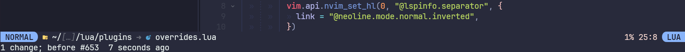
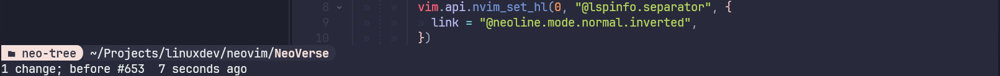
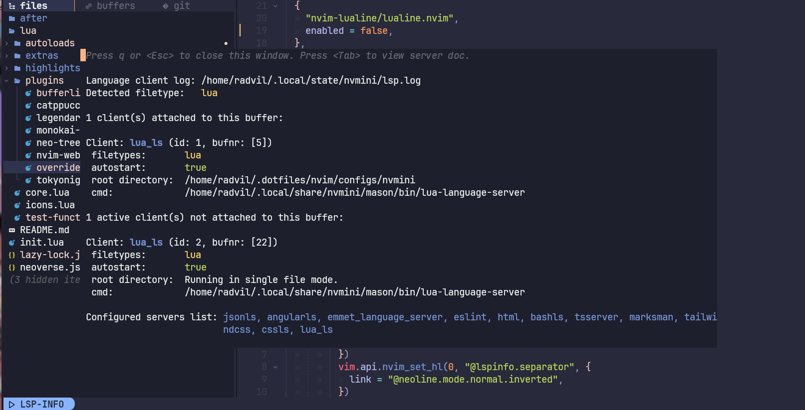

# NeoLine

Just a Neovim statusline plugin designed for simplicity.

## 📸 Screenshots

_Default active statusline_



_NeoTree statusline_



_LspInfo statusline_



## 🔧 Installation

You can install this plugin using [lazy.nvim](https://github.com/folke/lazy.nvim),
a lightweight plugin manager for Neovim.

First, ensure that you have lazy.nvim installed.
You can follow the installation instructions provided on the [lazy.nvim GitHub repository](https://github.com/folke/lazy.nvim).

Following is a sample configuration based on the defaults:

```lua
{
  'radvil/NeoLine',
  opts = {
    -- Customization for modes
    modes = {
      ui = {
        c = {
          name = "command",
          label = "Komandan",
          bg = "#f5e0dc",
        },
      },
    },
    specials = {
      -- Special configuration for displaying LSP information
      ["lspinfo"] = function()
        local utils = require("neo-line.utils")
        local sections = require("neo-line.sections")
        vim.api.nvim_set_hl(0, "@lspinfo", {
          bg = "#89b4fa",
          fg = "#1e1e2e",
          bold = true,
        })
        vim.api.nvim_set_hl(0, "@lspinfo.separator", {
          link = "@neoline.mode.normal.inverted",
        })
        return table.concat({
          utils.hl("@lspinfo", "  LSP-INFO "),
          utils.hl("@lspinfo.separator", ""),
          utils.hl("Normal"),
          sections.separator(),
        })
      end,
    }

    -- replace highlights
    custom_hls = {
      ["@neoline.fill"] = {
        fg = "#f5e0dc",
      },
      ["@neoline.text.base"] = {
        fg = "#313244",
      },
      ["@neoline.text.primary"] = {
        link = "@neoline.fill",
      },
      ["@neoline.neo-tree"] = {
        bg = "#f5e0dc",
        fg = "#313244",
        bold = true,
      },
      ["@neoline.neo-tree.filepath"] = {
        bg = "#313244",
      },
      ["@neoline.neo-tree.basepath"] = {
        bg = "#313244",
        fg = "#f5e0dc",
        bold = true,
      },
    }
  },
}
```

## License

This plugin is distributed under the MIT license.
See the [LICENSE](LICENSE) file for more information.

## Acknowledgements

This plugin is one of my attempts to know more about lua and vim api

## Contributing

Contributions are welcome!
If you encounter any issues or have suggestions for improvements,
please feel free to open an issue or submit a pull request on the GitHub repository.
